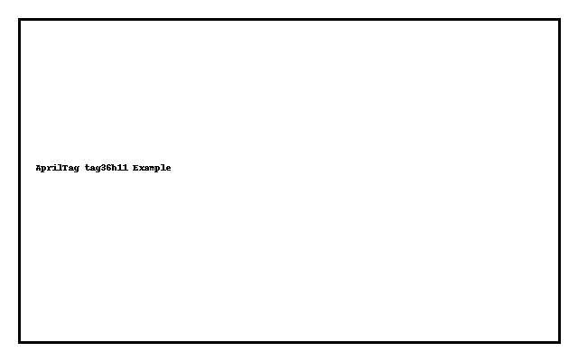
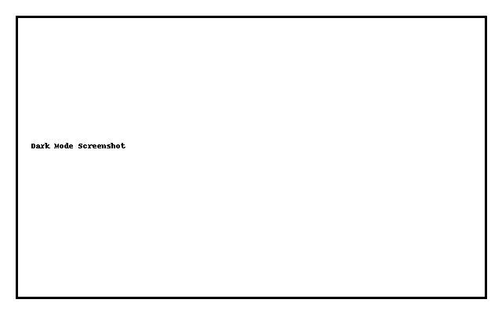
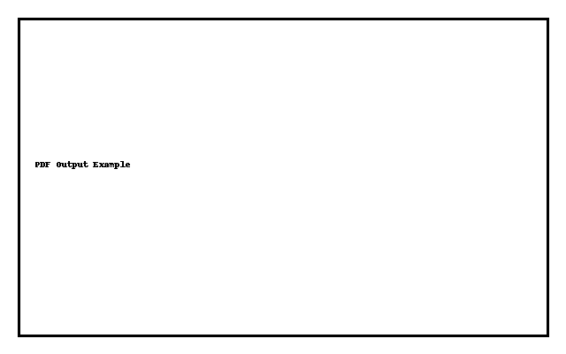

# AprilTag Generator

This project is a client-side AprilTag generator built using JavaScript and WebAssembly. It allows you to:

- ✅ Generate **PDFs** of AprilTags (one per page)
- ✅ Export **SVG** files (zipped)
- ✅ Choose from all major **AprilTag families**
- ✅ Select **ID range** and **paper size**
- ✅ Toggle **Dark Mode** for better visibility
- ✅ Works offline and on GitHub Pages

---

## 🔍 What are AprilTags?

**AprilTags** are 2D barcodes used in robotics, computer vision, and AR applications for:

- Precise **pose estimation**
- Object tracking
- Localization
- SLAM (Simultaneous Localization and Mapping)

They look like this:

---

## 🧩 AprilTag Family Comparison

| Tag Family         | Bits | Tags | Robustness | Use Case                      | Advantages                                      | Disadvantages                                   |
|--------------------|------|------|------------|-------------------------------|------------------------------------------------|------------------------------------------------|
| `tag16h5`          | 16   | 30   | Low        | Tiny tags, fast detection     | Small, fast                                     | Very low capacity, poor noise tolerance        |
| `tag25h7`          | 25   | 242  | Medium     | General-purpose               | Good balance of size and speed                 | Less robust than `h9` or `h11` variants        |
| `tag25h9`          | 25   | 35   | High       | Accuracy-critical systems     | High robustness                                | Very limited number of tags                    |
| `tag36h10`         | 36   | 2320 | Medium-High| Large-scale tracking          | Many IDs                                       | Slightly less robust than `36h11`              |
| `tag36h11`         | 36   | 587  | High       | Robotics, SLAM, AR            | Robust and popular                             | Moderate tag size required                     |
| `standard41h12`    | 41   | 2115 | Very High  | SLAM, high-accuracy vision    | Excellent error resistance                     | Slower to detect                               |
| `standard52h13`    | 52   | 587  | Very High  | Extreme environments          | Max robustness                                 | Very large, slow to detect                     |
| `custom48h12`      | 48   | ?    | Custom     | Proprietary applications      | Flexible design                                | Not widely supported                           |

---

## 📸 Screenshots

### 🎨 Dark Mode Enabled

### 🖨️ Generated PDF Page

---

## 📥 Usage

Just open [index.html](/docs/index.html) in your browser or visit the deployed version on GitHub Pages:

👉 [https://robertspark.github.io/apriltag-generator/](https://robertspark.github.io/apriltag-generator/)

1. Choose a tag family and ID range.
2. Select paper size.
3. Click **Generate PDF** or **Download SVGs**.
4. Print or use in your project!

---

## 📁 Credits

- AprilTag library: [apriltag-js](https://github.com/AprilRobotics/apriltag-js)
- PDF: [jsPDF](https://github.com/parallax/jsPDF)
- SVG ZIP: [JSZip](https://github.com/Stuk/jszip)

Licensed under MIT.
